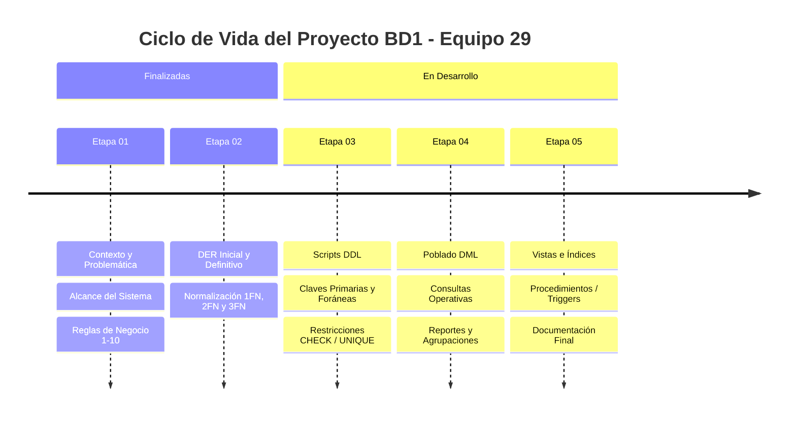
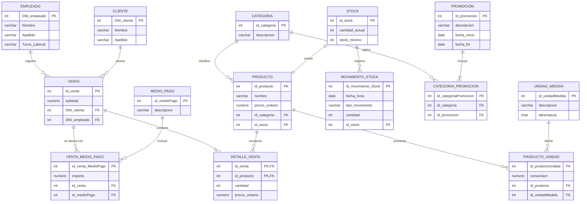

# <div align="center">🥖 Sistema de Gestión de Ventas — Panadería Tortuga</div>

<div align="center">

**Bases de Datos I** | **Facultad / Cátedra de Bases de Datos**  
**Equipo N° 29** • Ciclo Lectivo 2026

[](https://github.com/sofinazaret6-gif/proyecto-bd1-equipo-29)
[](https://github.com/sofinazaret6-gif/proyecto-bd1-equipo-29)
[](docs/etapa-01/)
[](docs/etapa-02/)
[](docs/etapa-02/normalizacion.md)

*Un modelo relacional optimizado para la gestión ágil de ventas de mostrador, pagos mixtos, control de stock y promociones en panaderías de barrio.*

---

[📋 Guía de Corrección Docente](#-guía-rápida-de-evaluación-para-docentes) •
[👥 Integrantes](#-integrantes-del-equipo-29) •
[🎯 Propuesta](#-sobre-el-proyecto) •
[📜 Reglas de Negocio](#-reglas-de-negocio-del-dominio) •
[📊 Modelo y Normalización](#-modelo-de-datos-y-normalización) •
[📂 Explorador de Archivos](#-estructura-del-repositorio)

---
</div>

## 📌 Tabla de Contenidos

1. [👩‍🏫 Guía Rápida de Evaluación para Docentes](#-guía-rápida-de-evaluación-para-docentes)
2. [👥 Integrantes del Equipo 29](#-integrantes-del-equipo-29)
3. [🎯 Sobre el Proyecto](#-sobre-el-proyecto)
   - [Contexto y Problemática](#contexto-y-problemática)
   - [Objetivos Principales](#objetivos-principales)
   - [Alcance del Sistema y Exclusiones](#alcance-del-sistema-y-exclusiones)
4. [📜 Reglas de Negocio del Dominio](#-reglas-de-negocio-del-dominio)
5. [🗺️ Hoja de Ruta de Entregas (Etapas)](#-hoja-de-ruta-de-entregas-etapas)
6. [📊 Modelo de Datos y Normalización](#-modelo-de-datos-y-normalización)
   - [Diagramas Entidad-Relación (DER)](#diagramas-entidad-relación-der)
   - [Evolución de Normalización (1FN ➔ 2FN ➔ 3FN)](#evolución-de-normalización-1fn--2fn--3fn)
   - [Diagrama Relacional Definitivo (3FN Interactivo)](#diagrama-relacional-definitivo-3fn-interactivo)
   - [Diccionario del Esquema Relacional](#diccionario-del-esquema-relacional)
7. [📂 Estructura del Repositorio](#-estructura-del-repositorio)
8. [💻 Instrucciones de Clonación y Uso](#-instrucciones-de-clonación-y-uso)

---

## 👩‍🏫 Guía Rápida de Evaluación para Docentes

Esta sección reúne los accesos directos a todos los entregables requeridos para la corrección y evaluación del proyecto:

| Entregable / Requisito | Documento / Recurso | Descripción |
| :--- | :--- | :--- |
| **Introducción y Contexto** | [`docs/etapa-01/Introduccion...md`](docs/etapa-01/Introduccion%20Gestion%20de%20Ventas%20de%20Panaderia.md) | Planteamiento del problema, objetivos y justificación inicial. |
| **Justificación del Proyecto** | [`docs/etapa-01/justificacion_Proyecto.md`](docs/etapa-01/justificacion_Proyecto.md) | Análisis de dominio, accesibilidad económica y arquitectura relacional. |
| **Alcance y Módulos** | [`docs/etapa-01/alcance_del_sistema.md`](docs/etapa-01/alcance_del_sistema.md) | Módulos POS, stock, catálogo, clientes y exclusiones deliberadas. |
| **Reglas de Negocio (1 al 5)** | [`docs/etapa-01/Reglas de Negocio.md`](docs/etapa-01/Reglas%20de%20Negocio.md) | Catálogo, control de stock, clientes, precio histórico y medios de pago. |
| **Reglas de Negocio (6 al 10)**| [`docs/etapa-01/Reglas de Negocio 6-10.md`](docs/etapa-01/Reglas%20de%20Negocio%206-10.md) | Comprobantes, compras, consistencia de inventario, promociones y calidad. |
| **DER Inicial (Borrador Chen)**| [`docs/etapa-02/Der/derInicial.png.png`](docs/etapa-02/Der/derInicial.png.png) | Primer diagrama conceptual en notación Peter Chen (ERDPlus). |
| **DER Definitivo (Chen)** | [`docs/etapa-02/Der/DerDefinitivo.jpeg`](docs/etapa-02/Der/DerDefinitivo.jpeg) | Modelo conceptual consolidado con stock, unidades y promociones. |
| **Memoria de Normalización** | [`docs/etapa-02/normalizacion.md`](docs/etapa-02/normalizacion.md) | Pasaje formal de 0FN a 1FN, 2FN y 3FN con justificación de dependencias. |
| **Diagramas Relacionales** | [`imagenes/`](imagenes/) | Esquemas de cada forma normal en imágenes y diagramas Mermaid. |
| **Módulos SQL (DDL / DML)** | [`sql/`](sql/) | Estructura de carpetas configurada para las etapas 03, 04 y 05. |

---

## 👥 Integrantes del Equipo 29

| Integrante | DNI |
| :--- | :---: |
| **Kiara Itatí Zacarías** | `46.717.369` |
| **Sofía Ferretti** | `46.718.162` |
| **Nicolás Pini** | `46.844.274` |
| **Lucas Martín Zárate** | `34.936.602` |
| **Octavio Dorrego** | `46.843.173` |

---

## 🎯 Sobre el Proyecto

### Contexto y Problemática
Las panaderías de barrio presentan una dinámica comercial de **alta rotación y velocidad**, despachando varios productos por minuto en horarios pico. Tradicionalmente, la operativa se realiza mediante anotaciones manuales en cuadernos, tickets sueltos o calculadoras, lo que provoca:
- Falta de concordancia entre el inventario físico y las ventas registradas.
- Imposibilidad de registrar de forma simple **pagos combinados** (ej. parte en efectivo y parte por billetera virtual o débito).
- Inexactitud financiera al no congelar los precios unitarios al momento exacto de la transacción ante variaciones de precios.

### Objetivos Principales
1. **Agilidad en el mostrador:** Un esquema de datos ágil y sin fricción para registrar ventas velozmente.
2. **Control de inventario:** Ficha única de stock por producto con historial auditable de movimientos atómicos (ingresos, mermas, ventas).
3. **Flexibilidad comercial:** Soporte para promociones temporales por categoría y múltiples medios de pago por ticket.
4. **Integridad de datos:** Un diseño relacional formalmente normalizado en **Tercera Forma Normal (3FN)** sin redundancias ni anomalías de actualización.

### Alcance del Sistema y Exclusiones
- **Incluido en el alcance:** Módulo de Punto de Venta (POS) multi-ítem, catálogo con unidades fraccionables y fijas (kg, unidad, docena), control de existencias en tiempo real con alertas de stock mínimo, gestión de compras para trazabilidad de costos, registro de clientes (opcional para cuentas corrientes) y promociones temporales.
- **Fuera de alcance deliberado:** No se incorporan módulos complejos de apertura y cierre de caja por turnos, ya que en comercios familiares la sesión operativa coincide con la jornada comercial diaria.

---

## 📜 Reglas de Negocio del Dominio

Las reglas de negocio que rigen la lógica de la base de datos se encuentran desglosadas en los documentos formales de la Etapa 01:

<details open>
<summary><b>📋 Resumen de Reglas de Negocio (RN.01 a RN.10)</b></summary>
<br>

| Regla | Título | Descripción Sintética | Documento Fuente |
| :---: | :--- | :--- | :---: |
| **RN.01** | **Productos y Unidades** | Cada producto pertenece a una única categoría y cuenta con unidades de medida definidas (kg, docena, unidad). | [`Reglas de Negocio.md`](docs/etapa-01/Reglas%20de%20Negocio.md) |
| **RN.02** | **Control de Stock** | Un producto posee una única ficha de stock con múltiples movimientos asociados (ingresos/egresos) y alerta de stock mínimo. | [`Reglas de Negocio.md`](docs/etapa-01/Reglas%20de%20Negocio.md) |
| **RN.03** | **Registro de Clientes** | Las ventas de mostrador pueden ser anónimas o vincularse a un cliente único para cuenta corriente o fidelización. | [`Reglas de Negocio.md`](docs/etapa-01/Reglas%20de%20Negocio.md) |
| **RN.04** | **Historial de Precios** | Cada ítem de venta almacena la cantidad y el precio unitario pactado al instante de la venta, garantizando inmutabilidad histórica. | [`Reglas de Negocio.md`](docs/etapa-01/Reglas%20de%20Negocio.md) |
| **RN.05** | **Pagos Combinados** | Una venta puede cancelarse con uno o más medios de pago, desglosando el importe abonado con cada uno. | [`Reglas de Negocio.md`](docs/etapa-01/Reglas%20de%20Negocio.md) |
| **RN.06** | **Comprobantes y Empleados**| Cada venta genera un comprobante con fecha, hora y el empleado responsable de la atención en el mostrador. | [`Reglas de Negocio 6-10.md`](docs/etapa-01/Reglas%20de%20Negocio%206-10.md) |
| **RN.07** | **Compras a Proveedores** | Las compras se asocian a un proveedor, registrando costo unitario de adquisición y alimentando el inventario. | [`Reglas de Negocio 6-10.md`](docs/etapa-01/Reglas%20de%20Negocio%206-10.md) |
| **RN.08** | **Validación de Stock** | No es posible confirmar una venta si la cantidad solicitada supera el stock físico disponible en el inventario. | [`Reglas de Negocio 6-10.md`](docs/etapa-01/Reglas%20de%20Negocio%206-10.md) |
| **RN.09** | **Promociones Temporales** | Las promociones (descuentos, 2x1) aplican a categorías de productos y están sujetas a un período de vigencia (fecha inicio/fin). | [`Reglas de Negocio 6-10.md`](docs/etapa-01/Reglas%20de%20Negocio%206-10.md) |
| **RN.10** | **Estandarización de Calidad**| Solo los productos que cumplan los estándares de maduración y control de calidad quedan habilitados para su comercialización. | [`Reglas de Negocio 6-10.md`](docs/etapa-01/Reglas%20de%20Negocio%206-10.md) |

</details>

---

## 🗺️ Hoja de Ruta de Entregas (Etapas)



<details>
<summary><b>🔎 Ver detalle del estado de cada etapa</b></summary>

| Etapa | Nombre | Estado | Entregables Principales |
| :---: | :--- | :---: | :--- |
| **01** | Relevamiento del Negocio | <kbd>✔ Completada</kbd> | Introducción, justificación, alcance del sistema y 10 reglas de negocio formales. |
| **02** | Modelado Conceptual y Lógico | <kbd>✔ Completada</kbd> | DER Peter Chen, conversión relacional y normalización formal hasta 3FN. |
| **03** | Implementación Física (DDL) | <kbd>⏳ Próximamente</kbd> | Estructura SQL con tipos de datos nativos, PKs, FKs, constraints y reglas de integridad referencial. |
| **04** | Manipulación y Consultas (DML) | <kbd>⏳ Próximamente</kbd> | Sets de datos de prueba, transacciones de venta, bajas/modificaciones y consultas analíticas de negocio. |
| **05** | Optimización y Cierre Técnico | <kbd>⏳ Próximamente</kbd> | Vistas de resumen, índices de rendimiento y conclusiones técnicas del proyecto. |

</details>

---

## 📊 Modelo de Datos y Normalización

### Diagramas Entidad-Relación (DER)
El modelado conceptual partió de los requerimientos y evolucionó hacia un diagrama consolidado:

- 🖼️ **Borrador Conceptual Inicial:** [Ver imagen `derInicial.png.png`](docs/etapa-02/Der/derInicial.png.png)
- 🖼️ **DER Definitivo (Peter Chen):** [Ver imagen `DerDefinitivo.jpeg`](docs/etapa-02/Der/DerDefinitivo.jpeg)

---

### Evolución de Normalización (1FN ➔ 2FN ➔ 3FN)

El proceso de refinamiento lógico se encuentra documentado en detalle en [`docs/etapa-02/normalizacion.md`](docs/etapa-02/normalizacion.md):

| Fase | Diagnóstico / Anomalía Resuelta | Solución Aplicada | Esquema Gráfico | Diagrama Mermaid |
| :---: | :--- | :--- | :---: | :---: |
| **Estado Inicial** | Relaciones directas del DER presentaban grupos repetitivos en stock y pagos únicos rígidos. | Mapeo inicial de tablas y detección formal de anomalías de 1FN. | [🖼️ Ver 0FN](imagenes/erdplus%20imagen%200.png) | [📄 Ver 0FN .md](imagenes/erdplus%20imagen%200.md) |
| **1FN** | Violación de atomicidad en `STOCK` (`fk_MOVIMIENTO_STOCK`) y en `VENTA` (`fk_MEDIO_DE_PAGO`). | Se traslada la FK a `MOVIMIENTO_STOCK` y se crea la tabla intermedia `VENTA_MEDIO_DE_PAGO` con atributo `importe`. | [🖼️ Ver 1FN](imagenes/erdplus%20imagen%201.png) | [📄 Ver 1FN .md](imagenes/erdplus%20imagen%201.md) |
| **2FN** | Dependencia funcional parcial en tabla intermedia `ASOCIA (fk_CLIENTE, fk_VENTA)` ($id\_venta \rightarrow dni\_Cliente$). | Se elimina la tabla intermedia y se incluye `fk_CLIENTE` directamente como clave foránea en `VENTA` ($1:N$). | [🖼️ Ver 2FN](imagenes/erdplus%20imagen%202.png) | [📄 Ver 2FN .md](imagenes/erdplus%20imagen%202.md) |
| **3FN** | Dependencia transitiva en `PROMOCION` (`tipoPromocion` $\rightarrow$ `Valor`) y falta de factor de conversión en unidades. | Se depura `PROMOCION`, se formaliza `PRODUCTO_UNIDAD` con `conversion` y se estandariza la nomenclatura. | [🖼️ Ver 3FN](imagenes/erdplus%20imagen%203.png) | [📄 Ver 3FN .md](imagenes/erdplus%20imagen%203.md) |

---

### Diagrama Relacional Definitivo (3FN Interactivo)

El siguiente diagrama ilustra la arquitectura de datos final en **Tercera Forma Normal (3FN)**, renderizado de forma nativa e interactiva:



---

### Diccionario del Esquema Relacional

<details>
<summary><b>🔍 Desplegar descripción detallada de tablas y claves (3FN)</b></summary>
<br>

| Tabla | Clave Primaria (PK) | Claves Foráneas (FK) | Descripción de Propósito |
| :--- | :--- | :--- | :--- |
| **`CLIENTE`** | `DNI_cliente` | — | Almacena información de contacto de clientes frecuentes del local. |
| **`EMPLEADO`** | `DNI_empleado` | — | Personal de mostrador y cajeros responsables de registrar ventas. |
| **`VENTA`** | `id_venta` | `DNI_cliente`, `DNI_empleado` | Cabecera del comprobante de venta, fecha/hora y subtotal. |
| **`MEDIO_PAGO`** | `id_medioPago` | — | Catálogo de formas de cobro (Efectivo, Débito, Transferencia, QR). |
| **`VENTA_MEDIO_PAGO`** | `id_venta_MedioPago` | `id_venta`, `id_medioPago` | Desglose atómico del importe abonado por cada medio de pago en una venta. |
| **`PRODUCTO`** | `id_producto` | `id_categoria`, `id_stock` | Catálogo de productos ofrecidos con su precio actual de venta. |
| **`DETALLE_VENTA`** | `(id_venta, id_producto)` | `id_venta`, `id_producto` | Líneas de artículos por venta con cantidad y precio unitario histórico. |
| **`CATEGORIA`** | `id_categoria` | — | Clasificación de productos (Panadería, Facturería, Confitería, etc.). |
| **`STOCK`** | `id_stock` | — | Ficha única de existencias actuales y umbral de alerta (stock mínimo). |
| **`MOVIMIENTO_STOCK`** | `id_movimiento_Stock`| `id_stock` | Libro de entradas, mermas y auditoría de inventario. |
| **`UNIDAD_MEDIDA`** | `id_unidadMedida` | — | Catálogo de unidades físicas (kg, g, unidad, docena). |
| **`PRODUCTO_UNIDAD`** | `id_productoUnidad` | `id_producto`, `id_unidadMedida` | Relación con factor de conversión para ventas fraccionadas o múltiples. |
| **`PROMOCION`** | `id_promocion` | — | Ofertas y descuentos temporales con fecha de inicio y fin. |
| **`CATEGORIA_PROMOCION`**| `id_categoriaPromocion`| `id_categoria`, `id_promocion` | Asignación de promociones a categorías de productos. |

</details>

---

## 📂 Estructura del Repositorio

El proyecto mantiene una estructura modular y organizada para facilitar la navegación a lo largo de todas las etapas de la cursada:

```text
proyecto-bd1-equipo-29/
├── 📄 README.md                                    # Presentación principal y portal de navegación
│
├── 📁 docs/                                        # Documentación académica por etapas
│   ├── 📁 etapa-01/                                # Relevamiento inicial del negocio
│   │   ├── 📄 Introduccion Gestion de Ventas...md  # Planteo del negocio y contexto general
│   │   ├── 📄 justificacion_Proyecto.md            # Análisis de dominio, economía y arquitectura
│   │   ├── 📄 alcance_del_sistema.md               # Alcance funcional y exclusiones del sistema
│   │   ├── 📄 Reglas de Negocio 1-5.md             # Reglas de negocio 01 a 05
│   │   └── 📄 Reglas de Negocio 6-10.md            # Reglas de negocio 06 a 10
│   │
│   ├── 📁 etapa-02/                                # Modelado y Normalización
│   │   ├── 📁 Der/                                 # Diagramas Entidad-Relación (notación Peter Chen)
│   │   │   ├── 🖼️ derInicial.png.png               # DER borrador inicial
│   │   │   └── 🖼️ DerDefinitivo.jpeg               # DER final del dominio
│   │   └── 📄 normalizacion.md                     # Memoria técnica del proceso 1FN, 2FN y 3FN
│   │
│   ├── 📁 etapa-03/                                # Carpeta para scripts DDL
│   ├── 📁 etapa-04/                                # Carpeta para scripts DML y consultas
│   └── 📁 etapa-05/                                # Carpeta para optimización y cierre técnico
│
├── 📁 imagenes/                                    # Recursos gráficos y diagramas Mermaid
│   ├── 🖼️ erdplus imagen 0.png / 📄 .md            # Esquema lógico inicial (0FN)
│   ├── 🖼️ erdplus imagen 1.png / 📄 .md            # Esquema en 1FN (gráfico y Mermaid)
│   ├── 🖼️ erdplus imagen 2.png / 📄 .md            # Esquema en 2FN (gráfico y Mermaid)
│   └── 🖼️ erdplus imagen 3.png / 📄 .md            # Esquema en 3FN final (gráfico y Mermaid)
│
└── 📁 sql/                                         # Código fuente SQL del proyecto
    ├── 📁 ddl/                                     # Definición de datos (CREATE TABLE, ALTER, etc.)
    ├── 📁 dml/                                     # Inserción de datos (INSERT, UPDATE, DELETE)
    ├── 📁 consultas/                               # Consultas SELECT, reportes y métricas
    └── 📁 tecnico/                                 # Triggers, procedimientos almacenados y vistas
```

---

## 💻 Instrucciones de Clonación y Uso

Para clonar localmente el repositorio y explorar todos sus documentos y recursos:

```bash
# Clonar el repositorio
git clone https://github.com/sofinazaret6-gif/proyecto-bd1-equipo-29.git

# Ingresar al directorio del proyecto
cd proyecto-bd1-equipo-29

# Visualizar el estado del repositorio
git status
```

---

<div align="center">
<sub>Proyecto desarrollado colaborativamente para la materia <b>Bases de Datos I</b> • <b>Equipo 29</b> • 2026</sub>
</div>
