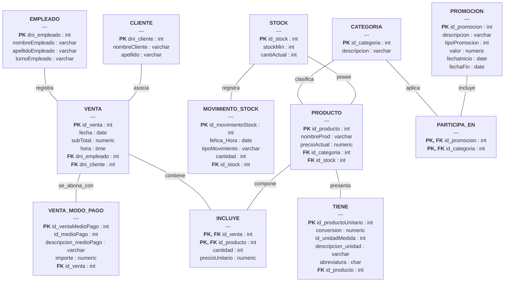

```mermaid
flowchart TD
    CLIENTE["`**CLIENTE**
    ---
    **PK** dni_cliente : int
    nombreCliente : varchar
    apellido : varchar`"]

    EMPLEADO["`**EMPLEADO**
    ---
    **PK** dni_empleado : int
    nombreEmpleado : varchar
    apellidoEmpleado : varchar
    turnoEmpleado : varchar`"]

    PROMOCION["`**PROMOCION**
    ---
    **PK** id_promocion : int
    descripcion : varchar
    tipoPromocion : int
    valor : numeric
    fechaInicio : date
    fechaFin : date`"]

    CATEGORIA["`**CATEGORIA**
    ---
    **PK** id_categoria : int
    descripcion : varchar`"]

    STOCK["`**STOCK**
    ---
    **PK** id_stock : int
    stockMin : int
    cantiActual : int`"]

    PRODUCTO["`**PRODUCTO**
    ---
    **PK** id_producto : int
    nombreProd : varchar
    precioActual : numeric
    **FK** id_categoria : int
    **FK** id_stock : int`"]

    TIENE["`**TIENE**
    ---
    **PK** id_productoUnitario : int
    conversion : numeric
    id_unidadMedida : int
    descripcion_unidad : varchar
    abreviatura : char
    **FK** id_producto : int`"]

    MOVIMIENTO_STOCK["`**MOVIMIENTO_STOCK**
    ---
    **PK** id_movimientoStock : int
    fehca_Hora : date
    tipoMovimiento : varchar
    cantidad : int
    **FK** id_stock : int`"]

    VENTA["`**VENTA**
    ---
    **PK** id_venta : int
    fecha : date
    subTotal : numeric
    hora : time
    **FK** dni_empleado : int
    **FK** dni_cliente : int`"]

    INCLUYE["`**INCLUYE**
    ---
    **PK, FK** id_venta : int
    **PK, FK** id_producto : int
    cantidad : int
    precioUnitario : numeric`"]

    VENTA_MODO_PAGO["`**VENTA_MODO_PAGO**
    ---
    **PK** id_ventaMedioPago : int
    id_medioPago : int
    descripcion_medioPago : varchar
    importe : numeric
    **FK** id_venta : int`"]

    PARTICIPA_EN["`**PARTICIPA_EN**
    ---
    **PK, FK** id_promocion : int
    **PK, FK** id_categoria : int`"]

    EMPLEADO ---|registra| VENTA
    CLIENTE ---|asocia| VENTA
    VENTA ---|se_abona_con| VENTA_MODO_PAGO
    VENTA ---|contiene| INCLUYE
    PRODUCTO ---|compone| INCLUYE
    CATEGORIA ---|clasifica| PRODUCTO
    STOCK ---|posee| PRODUCTO
    STOCK ---|registra| MOVIMIENTO_STOCK
    CATEGORIA ---|aplica| PARTICIPA_EN
    PROMOCION ---|incluye| PARTICIPA_EN
    PRODUCTO ---|presenta| TIENE
```