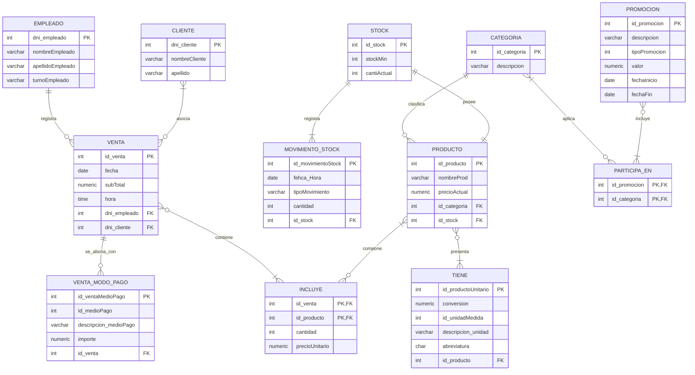

```mermaid
erDiagram
    CLIENTE {
        int dni_cliente PK
        varchar nombreCliente
        varchar apellido
    }

    EMPLEADO {
        int dni_empleado PK
        varchar nombreEmpleado
        varchar apellidoEmpleado
        varchar turnoEmpleado
    }

    PROMOCION {
        int id_promocion PK
        varchar descripcion
        int tipoPromocion
        numeric valor
        date fechaInicio
        date fechaFin
    }

    CATEGORIA {
        int id_categoria PK
        varchar descripcion
    }

    STOCK {
        int id_stock PK
        int stockMin
        int cantiActual
    }

    PRODUCTO {
        int id_producto PK
        varchar nombreProd
        numeric precioActual
        int id_categoria FK
        int id_stock FK
    }

    TIENE {
        int id_productoUnitario PK
        numeric conversion
        int id_unidadMedida
        varchar descripcion_unidad
        char abreviatura
        int id_producto FK
    }

    MOVIMIENTO_STOCK {
        int id_movimientoStock PK
        date fehca_Hora
        varchar tipoMovimiento
        int cantidad
        int id_stock FK
    }

    VENTA {
        int id_venta PK
        date fecha
        numeric subTotal
        time hora
        int dni_empleado FK
        int dni_cliente FK
    }

    INCLUYE {
        int id_venta PK, FK
        int id_producto PK, FK
        int cantidad
        numeric precioUnitario
    }

    VENTA_MODO_PAGO {
        int id_ventaMedioPago PK
        int id_medioPago
        varchar descripcion_medioPago
        numeric importe
        int id_venta FK
    }

    PARTICIPA_EN {
        int id_promocion PK, FK
        int id_categoria PK, FK
    }

    EMPLEADO ||--o{ VENTA : registra
    CLIENTE }|--o{ VENTA : asocia
    VENTA ||--o{ VENTA_MODO_PAGO : se_abona_con
    VENTA }o--|{ INCLUYE : contiene
    PRODUCTO }|--o{ INCLUYE : compone
    CATEGORIA ||--o{ PRODUCTO : clasifica
    STOCK ||--|| PRODUCTO : posee
    STOCK ||--|{ MOVIMIENTO_STOCK : registra
    CATEGORIA }|--o{ PARTICIPA_EN : aplica
    PROMOCION }o--|{ PARTICIPA_EN : incluye
    PRODUCTO }o--|{ TIENE : presenta
```