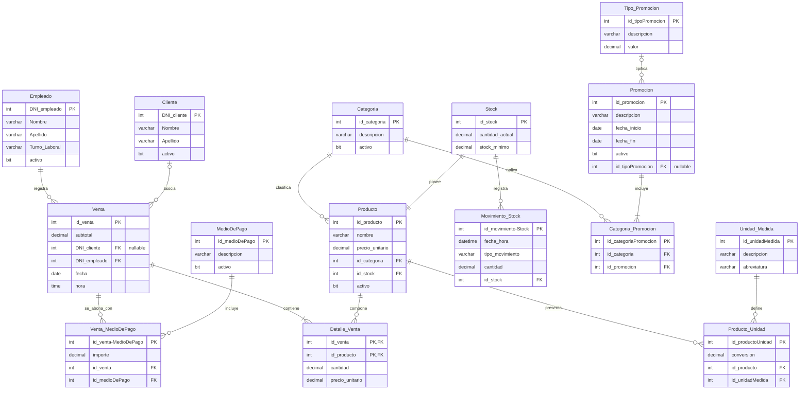

```mermaid
erDiagram
    Empleado ||--o{ Venta : registra
    Cliente |o--o{ Venta : asocia
    Venta ||--o{ Venta_MedioDePago : se_abona_con
    MedioDePago ||--o{ Venta_MedioDePago : incluye
    Venta ||--|{ Detalle_Venta : contiene
    Producto ||--o{ Detalle_Venta : compone
    Categoria ||--o{ Producto : clasifica
    Stock ||--|| Producto : posee
    Stock ||--o{ Movimiento_Stock : registra
    Categoria ||--o{ Categoria_Promocion : aplica
    Promocion ||--|{ Categoria_Promocion : incluye
    Tipo_Promocion |o--o{ Promocion : tipifica
    Producto ||--o{ Producto_Unidad : presenta
    Unidad_Medida ||--o{ Producto_Unidad : define

    Cliente {
        int DNI_cliente PK
        varchar Nombre
        varchar Apellido
        bit activo
    }

    Empleado {
        int DNI_empleado PK
        varchar Nombre
        varchar Apellido
        varchar Turno_Laboral
        bit activo
    }

    Venta {
        int id_venta PK
        decimal subtotal
        int DNI_cliente FK "nullable"
        int DNI_empleado FK
        date fecha
        time hora
    }

    Detalle_Venta {
        int id_venta PK, FK
        int id_producto PK, FK
        decimal cantidad
        decimal precio_unitario
    }

    Venta_MedioDePago {
        int id_venta-MedioDePago PK
        decimal importe
        int id_venta FK
        int id_medioDePago FK
    }

    MedioDePago {
        int id_medioDePago PK
        varchar descripcion
        bit activo
    }

    Producto {
        int id_producto PK
        varchar nombre
        decimal precio_unitario
        int id_categoria FK
        int id_stock FK
        bit activo
    }

    Categoria {
        int id_categoria PK
        varchar descripcion
        bit activo
    }

    Stock {
        int id_stock PK
        decimal cantidad_actual
        decimal stock_minimo
    }

    Movimiento_Stock {
        int id_movimiento-Stock PK
        datetime fecha_hora
        varchar tipo_movimiento
        decimal cantidad
        int id_stock FK
    }

    Producto_Unidad {
        int id_productoUnidad PK
        decimal conversion
        int id_producto FK
        int id_unidadMedida FK
    }

    Unidad_Medida {
        int id_unidadMedida PK
        varchar descripcion
        varchar abreviatura
    }

    Promocion {
        int id_promocion PK
        varchar descripcion
        date fecha_inicio
        date fecha_fin
        bit activo
        int id_tipoPromocion FK "nullable"
    }

    Tipo_Promocion {
        int id_tipoPromocion PK
        varchar descripcion
        decimal valor
    }

    Categoria_Promocion {
        int id_categoriaPromocion PK
        int id_categoria FK
        int id_promocion FK
    }
```
